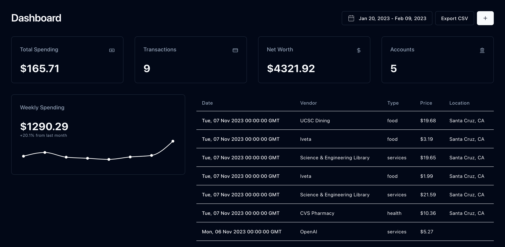

# Finance

Personal finance dashboard that **ingests**, **analyzes**, and **aggregates transaction data** from various financial sources so I don't have to.



## The Idea

I need to collect statements from various places where API access (like Plaid) is not easily available. However, all this information still needs to be itemized and logged on a monthly basis.

`Finance` allows me to upload different kinds of statements and use OCR & ChatGPT to extract data from them. Then, I can record all my expenses and invoices to make sure I don't overspend.

### Data Sources

- Apple Card
- Amex
- CitiBank
- Wells Fargo
- Apple Savings

### Tech Stack

- AWS
- NextJS + Typescript + Kysely
- Postgres
- GPT-4

## Note for Deploying:

The following environment variables must be configured in the Next.JS app:

- `OPENAI_API_KEY`
- `AWS_ACCESS_KEY_ID`
- `AWS_SECRET_ACCESS_KEY`
- `POSTGRES_CONN_URL`

The IAM user configured with those credentials must have access to S3 and Textract. The bucket itself must ahve the following CORS policy:

```json
[
  {
    "AllowedHeaders": ["*"],
    "AllowedMethods": ["GET", "PUT", "POST"],
    "AllowedOrigins": ["*"],
    "ExposeHeaders": []
  }
]
```
