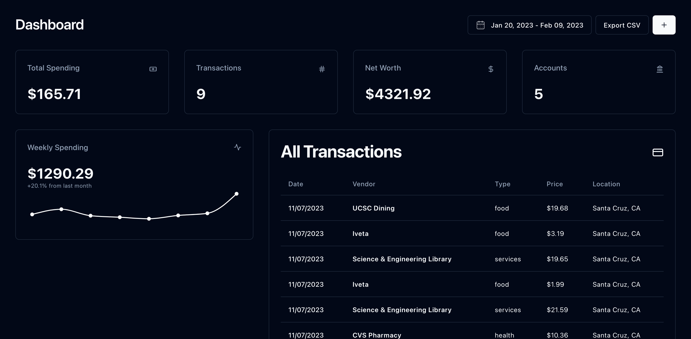

# Finance

**Ingests**, **analyzes**, and **aggregates transaction data** from various financial sources so I don't have to.



## The Idea

I need to collect statements from various places where API access (like Plaid) is not easily available. However, all this information still needs to be itemized and logged on a monthly basis.

`Finance` allows me to upload different kinds of statements and use OCR & ChatGPT to extract data from them. Then, I can record all my expenses and invoices to make sure I don't overspend.

### Data Sources

- Apple Card
- Amex
- CitiBank
- Wells Fargo
- Apple Savings

### Tech Stack

- AWS
- NextJS + Typescript + Kysely
- Postgres
- GPT-4

## Note for Deploying

### Environment Variables

The following environment variables must be configured in the Next.JS app:

- `OPENAI_API_KEY`
- `AWS_ACCESS_KEY_ID`
- `AWS_SECRET_ACCESS_KEY`
- `POSTGRES_CONN_URL`

### IAM User Configuration

The IAM user configured with those credentials must have access to S3 and Textract.

### Uploads S3 Bucket

Artifacts uploaded through the dashboard are stored in an S3 bucket. The bucket is hardcoded to `finance-uploads-592951731404`.

Here's how the frontend works:

1. Frontend makes a POST request to `/api/upload`, the bodies are described below:

```typescript
export type UploadRequest = {
  name: string;
};

export type UrlResponse = {
  name: string;
  key: string;
  bucket: string;

  getUrl: string;
  uploadUrl: string;

  expires: number;
};
```

2. Uploads artifact to S3 bucket using the returned presigned urls
3. Makes POST request to `/api/extract` with the following bodies:

```typescript
export type ExtractRequest = {
  file: UrlResponse;
  type: StatementType;
};

export type ExpenseResponse = {
  spending: number;
  transactions: FormattedExpense[];
};
```

#### S3 CORS Configuration

```json
[
  {
    "AllowedHeaders": ["*"],
    "AllowedMethods": ["GET", "PUT", "POST"],
    "AllowedOrigins": ["*"],
    "ExposeHeaders": []
  }
]
```
